# Cómo hackear una 3DS desde cero
En esta guía no nos andaremos con explicaciones de que es un CFW o como funcionan los programas que usaremos.

Si has venido buscando explicaciones, búsca en [Google](https://google.com), aquí **solo** explicaremos la parte práctica de las cosas.

## 1. Requisitos para el hack
Si tu consola es del modelo NEW, necesitarás una tarjeta Micro SD. Normalmente ya deberías tener una.

Por el otro lado, si el modelo de tu consola es OLD, es decir, simplemente se llama Nintendo 3DS necesitarás una tarjeta SD o bien una micro SD con un adaptador de SD.

La capacidad que yo recomiendo para las tarjetas es de 32 GB (Gigabytes).

Además, necesitarás un ordenador en el que meter esa tarjeta y trabajar con ella.

**IMPORTANTE**: la tarjeta SD/MicroSD debe de haber sido utilizada por la consola al menos una vez. ¿Que qué quiero decir con esto? Que debe contener una carpeta llamada Ninendo 3DS. Esta carpeta se genera al momento de que la consola detecte la tarjeta por primera vez. Si la carpeta no existe, simplemente conecta la tarjeta a la 3DS y enciéndela. Aparecerá un mensaje que dirá que se están creando los datos del menú HOME. Cuando haya terminado, ya puedes apagar la consola y sacar la tarjeta.

**NUNCA SAQUES LA TARJETA MIENTRAS LA CONSOLA ESTÁ ENCENDIDA. PODRÍA RESULTAR EN UNA CORRUPCIÓN DE LA MEMORIA Y HACER QUE PIERDAS TEMPORALMENTE EL ACCESO A LA 3DS HACKEADA.**

## 2. Copiando archivos

¡Comencemos a hackear!

Lo primero que debemos hacer es meter nuestra tarjeta de memoria al ordenador.

Allí veremos una carpeta llamada Nintendo 3DS. Copiaremos la carpeta a algún lugar temporal, como el escritorio, ya que después la volveremos a poner en la tarjeta.

Despues de copiar dicha carpeta, debemos borrarla de la tarjeta. Tranquilo, en el caso de tener juegos o archivos de guardado, no se borrarán, ya que más tarde recuperaremos la carpeta de nuestro escritorio.

## 3. Instalando Python

Para poder ejecutar parte de los programas del tutorial necesitarás instalar **Python**.

Si no lo tienes instalado, puedes pulsar [aquí](https://www.python.org/downloads/) para ir a la web de descarga.

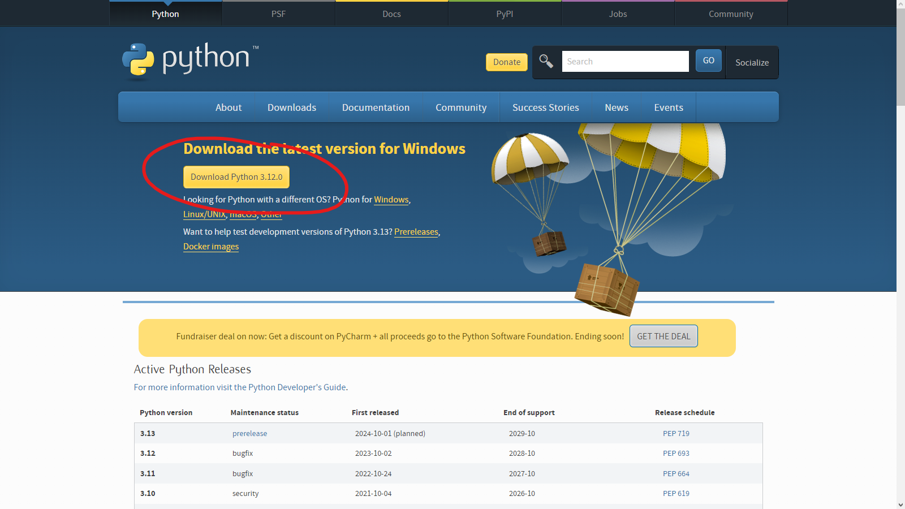

Simplemente pulsa en descargar y abre el instalador. Cuando termine, puedes proseguir.

## 4. Los datos del menú HOME.

Sacaremos la tarjeta del ordenador (sin la carpeta de Nintendo 3DS) y la meteremos a la 3DS.

Encenderemos la consola. Nos aparecerá esto:

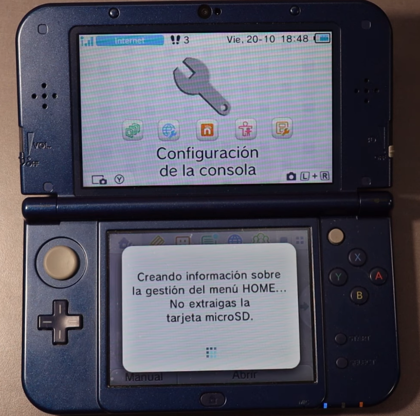

Cuando la ventana desaparezca, entraremos en el Editor de Mii. Al entrar, tardará un poco en crear los datos, pero cuando cargue por completo, cerraremos el editor y apagaremos la consola.

Meteremos la tarjeta al ordenador. Debemos abrir el archivo [3DS HACK 11.17.zip](https://www.mediafire.com/file/kirzhlezu3k34o8/3DS+HACK+v11.17.zip/file) y colocar todos sus archivos en la raíz de la tarjeta.

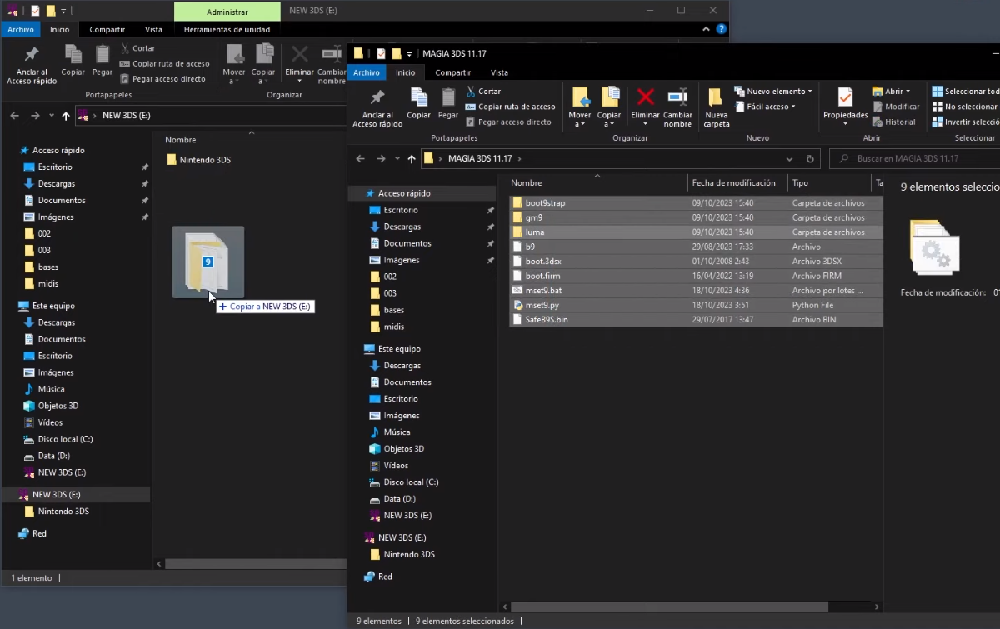

Cuando lo hayamos hecho, debemos ejecutar el archivo mset9.bat **dentro de la tarjeta SD**. Si lo hacemos fuera de la tarjeta no funcionará.

Al abrirlo, nos aparecerá la siguiente ventana:

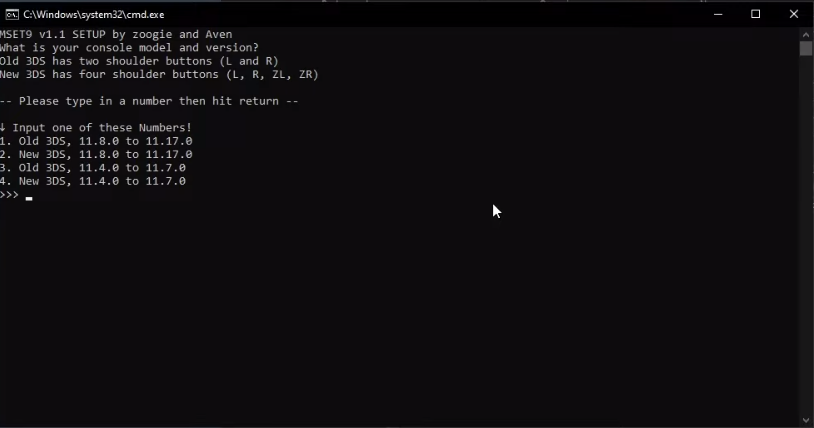

Debemos escoger una opción entre la 1 y la dos. La 3 y la 4 son para versiones anteriores y, por lo tanto, no deben de ser utilizadas.

Pulsamos en la tecla del número correspondiente y luego pulsamos enter.

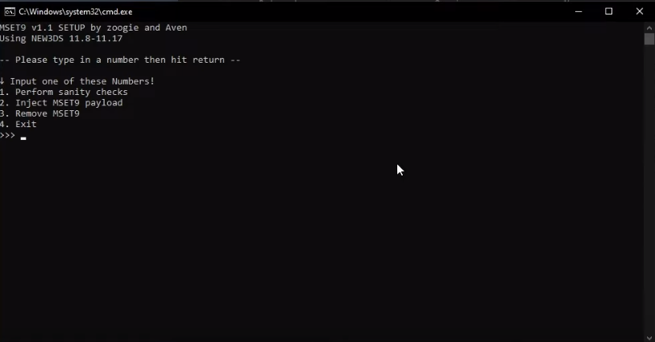

Nos aparecerán 4 opciones nuevas. Pulsamos el 1 y luego enter.

Nos dará un error, pero es normal. Pulsaremos enter para cerrar la ventana.

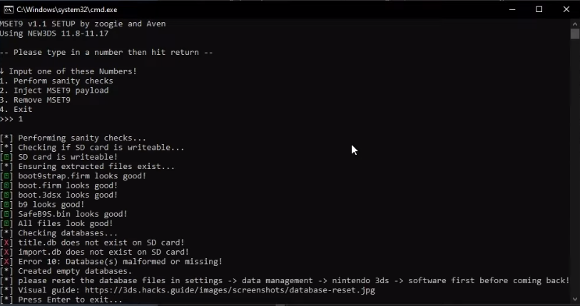

Sacaremos la tarjeta del ordenador y la pondremos en la consola. Ahora, la encenderemos.

## 5. Arreglando el error

Cuando la consola se encienda, vamos hasta la configuración de la consola.

Una vez dentro, pulsaremos en Gestión de datos > Nintendo 3DS > Programas.

Nos avisará de que hay datos corruptos, y pulsaremos en borrar, para así arreglar el error de antes.

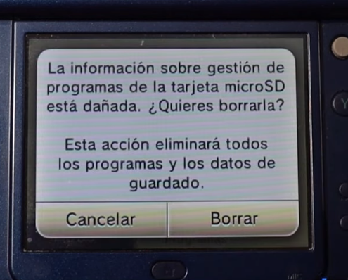

Cuando termine de borrar, podemos salir de la configuración y apagar la consola.

Cuando la apaguemos, volveremos a meter la tarjeta al ordenador.

Abriremos mset9.bat. Seleccionaremos el modelo de la consola entre 1 y 2.

Entre las 4 nuevas opciones escogeremos la 1 de nuevo. No debería de darnos ningún error, como en esta imagen:

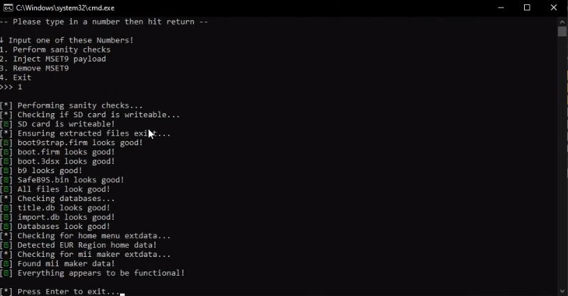

Pulsaremos enter para cerrar la ventana y sacaremos la tarjeta del ordenador. La volveremos a meter en la 3DS.

## 6. Precisión absoluta

En esta parte de la guía debes hacer **exactamente** lo que se indique. Ni un botón más, ni uno menos.

Abriremos la configuración de la consola. Iremos a Gestión de datos > Nintendo 3DS > Datos adicionales. Solo debería aparecer el Editor de Mii.

Sin tocar nada más, sacaremos la tarjeta de la consola (**estando encendida**) y la pondremos en el ordenador. Si durante el proceso de sacar la tarjeta nos avisa de que no se detecta ninguna tarjeta, lo estamos haciendo bien.

En el PC, ejecutaremos de nuevo mset9.bat y escogeremos el modelo de nuestra consola.

Ahora, en lugar de pulsar en 1 en las 4 nuevas opciones, **le daremos al 2**. Cuando termine, le daremos a enter para salir.

Sacaremos la tarjeta y la pondremos de nuevo en la consola.

Aparecerá que está cargando y, tras unos segundos, se verá GodMode9. Esto nos permitirá instalar el hack en la 3DS.

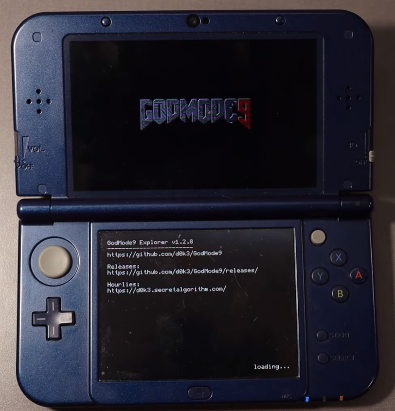

Pulsaremos el botón HOME y aparecerá este menú:

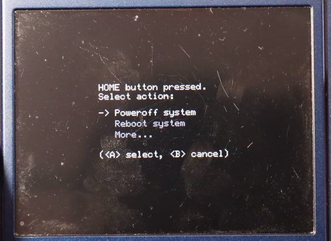

Le daremos a More > Scripts...

Veremos dos scripts. Pulsaremos en el que dice Paso 1.

Veremos varios textos:

`Este script instalará Boot9. Continuar?`

Pulsaremos la A para continuar.

Veremos otro mensaje. Pulsaremos A también.

Tras ello, veremos una pantalla roja junto con texto y una combinación de flechas. Debemos pulsar esa combinación.

No intentes copiar la de la imagen, porque siempre será una distinta.

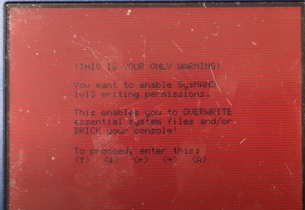

Cuando acabe, mostrará un mensaje diciendo:

`Consola hackeada. #TeAmoKelonio`

Cuando se muestre, pulsaremos A.

Si nos pregunta cualquier cosa sobre la Fecha/Hora, pulsaremos B para ignorarlo.

¡Ahora, GodMode9 estará traducido al español! ^_^.

Repetiremos el proceso anterior. Pulsaremos en HOME. Iremos a Scripts y ejecutaremos el Paso 2.

Nos volverá a saltar otro diálogo. Pulsaremos la A y colocaremos la secuencia de flechas de la pantalla siguiente.

Cuando acabe, mostrará un mensaje diciendo:

`Actualizacion finalizada! #TeAmoKelonio`

Pulsaremos la A.

Una vez hecho eso, se abrirá el menú de Luma.

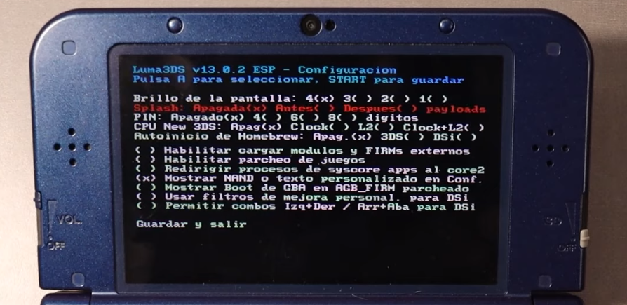

Con las flechas iremos hasta donde dice Splash y pulsaremos una sola vez el botón A.

Cuando lo hagamos, pulsaremos START.

Se mostrará el splash de seguridad. Será muy útil, por si algún día tienes errores graves:

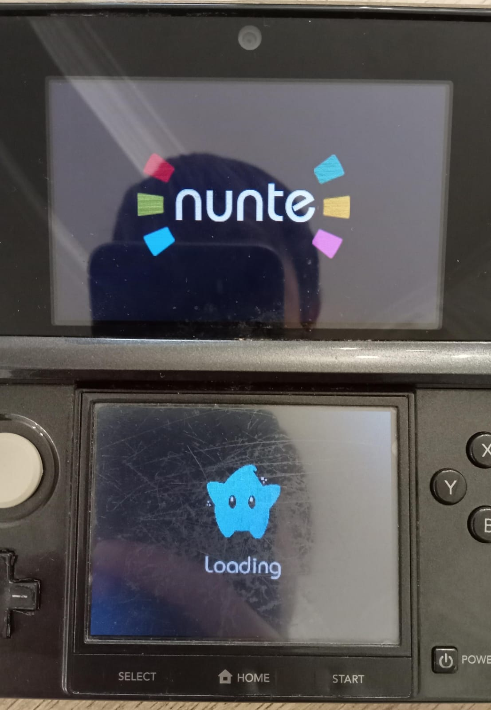
Para crear un splash personalizado, puedes visitar [esta página de la guía](customsplash.md).

Verás que hay un programa nuevo, llamado FBI.

Sin hacer nada más, apagaremos la consola, sacaremos la tarjeta y la meteremos en el ordenador.

## 7. Arreglando la SD

Abriremos mset9.bat y escogeremos nuestro modelo de consola.

En las 4 nuevas opciones escogeremos la 3. Cuando termine, pulsaremos enter. Ahora vamos a borrar un par de archivos que no nos harán falta nunca más.

Borraremos la carpeta `boot9stap` y los archivos `b9`, `mset9.bat`, `mset9.py` y `SafeB9S.bin`.

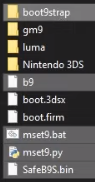

Por último, borraremos la carpeta Nintendo 3DS de la tarjeta y colocaremos la original que copiamos al principio del tutorial para recuperar todo.

## 8. Copiando la NAND.

Con la tarjeta dentro, encenderemos la consola. Abriremos el programa FBI e iremos a la opción Copia de seguridad de NAND.

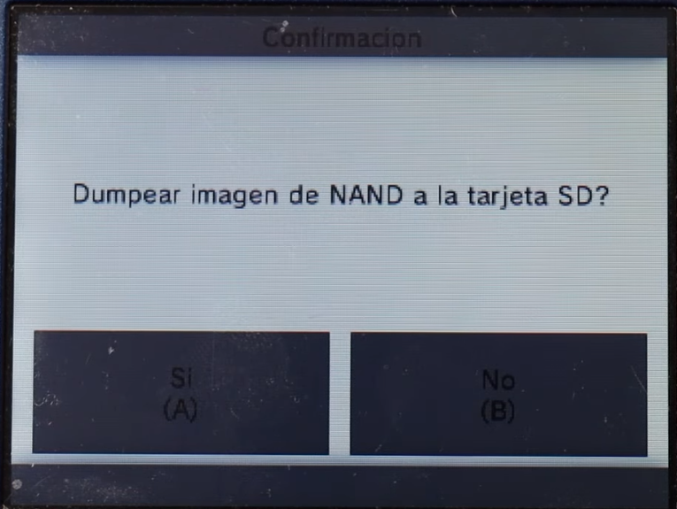

El proceso le llevará unos 6-7 minutos.

Cuando termine, pulsaremos A.

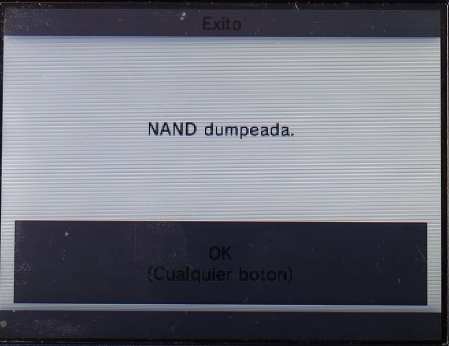

Lo que acabamos de hacer es copiar toda la memoria de la consola a la tarjeta SD.

Sacaremos la tarjeta y la pondremos en el PC.

Iremos a la carpeta `fbi` y luego a `nand`. Ahí encontraremos un archivo que comenzará por `NAND_`.

**Este archivo contiene toda la memoria de la consola por si algún día ocurriera un error fatal. Es muy importante que guardemos esta copia en algún lugar seguro del ordenador.**

## 9. Disfruta

Después de hacer eso último, te felicito, porque ¡**tu 3DS ya está hackeada**!

Aquí tienes una lista de cosas que hacer después:

- [Instalar la tienda de juegos (hShop)](hshop.md)