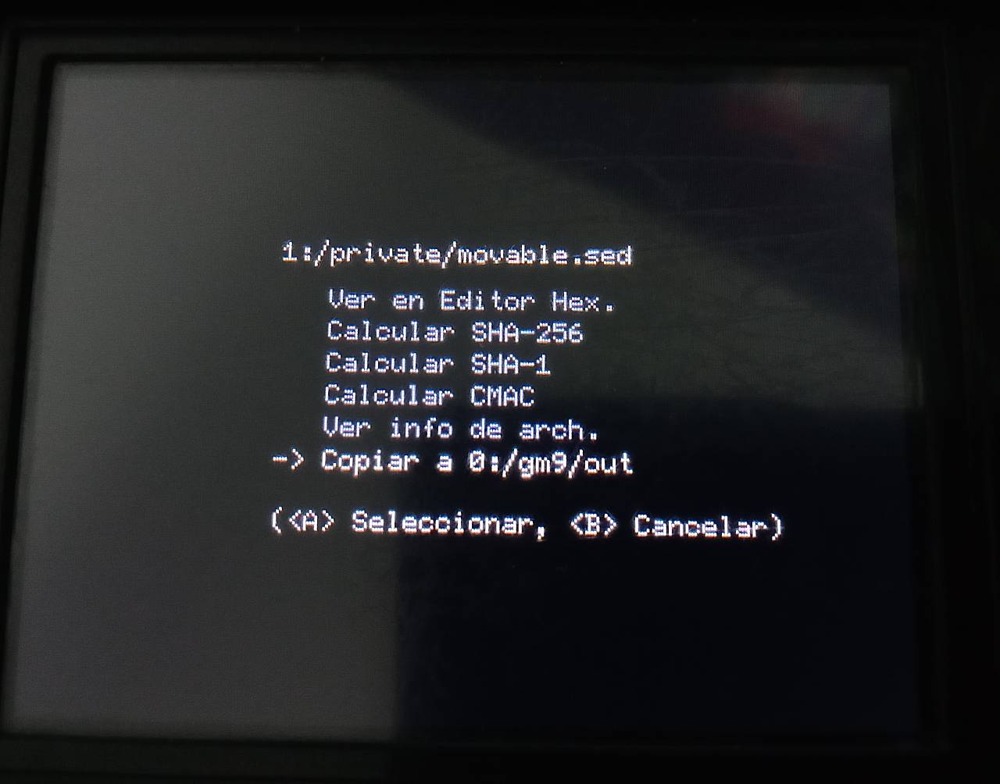
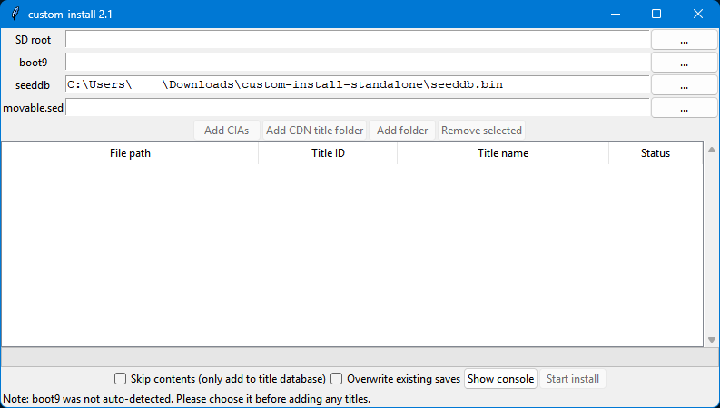
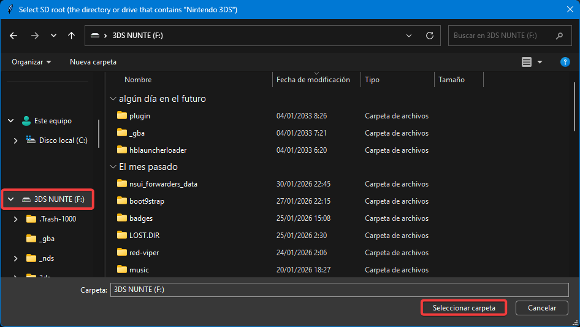
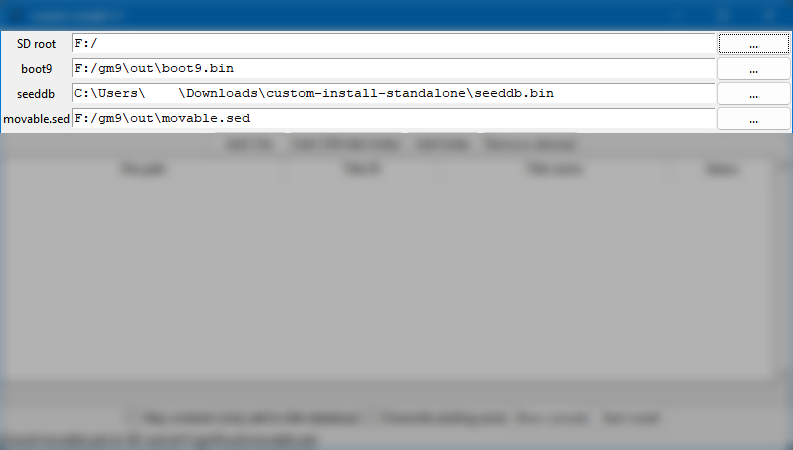

# *custom-install*: instala juegos 10 veces más rápido

*custom-install* es un programa que nos permite instalar juegos muchísimo más rapido a nuestra 3DS. Se encarga de extraer y copiar los archivos necesarios a la Tarjeta SD para que solo tengamos que pulsar un par de botones en la consola para instalar el juego. En esta guía se explica **cómo ponerlo todo a funcionar**.

## Paso 1: Instalar *custom-install*

Ve a [ihaveamac/custom-install](https://github.com/ihaveamac/custom-install/releases/latest) y descarga el archivo `custom-install-standalone.zip`. Necesitarás extraerlo para poder usarlo. Luego, abre `ci-gui.exe`.

Te recomiendo que, en la misma carpeta que `custom-install` añadas el archivo [`seeddb.bin` (link)](https://github.com/ihaveamac/3DS-rom-tools/raw/master/seeddb/seeddb.bin), que necesitarás para una lista concreta de juegos. En caso de no tenerlo la instalación fallará.

## Paso 2: Extraer los archivos necesarios

Para que *custom-install* pueda instalar cosas a la SD necesita unos archivos para trabajar. Estos son `movable.sed` y `boot9.bin`. Voy a explicar cómo se extraen.

Para empezar, enciende la consola mientras pulsas el botón START. Esto provocará que entre en GodMode9.

**AVISO: NO BORRES NINGÚN ARCHIVO DE LOS QUE COPIAREMOS CON GODMODE9. SON ARCHIVOS CRUCIALES PARA EL FUNCIONAMIENTO DE LA CONSOLA Y ELIMINARLOS PODRÍA SUPONER UN [BRICKEO](diccionario.md#brickear).**

Una vez allí, iremos a `[1:] SYSNAND CTRNAND` → `private`, allí estará `movable.sed`. Pulsa A y escoge la opción `Copiar a 0:/gm9/out`.

Después de copiar, pulsa B hasta que estés de vuelta en la pantalla inicial. Ahora entra a `[M:] MEMORIA VIRTUAL` y baja en la lista hasta tener seleccionado el archivo `boot9.bin`. Pulsa A sobre él y selecciona la opción de `Copiar a 0:/gm9/out` como hiciste con el otro archivo.

Ya has acabado de copiar archivos. Pulsa el botón 🏠︎ HOME y pulsa A sobre `Apagar sistema`.

## Paso 3: Instalar tus juegos

Ahora vamos a meter los juegos como tal. Puedes descargarlos de la [hShop](hshop.md) sin usar una 3DS real.

Que conste que **se puede instalar cualquier archivo `.cia`**: pueden ser juegos, actualizaciones, DLCs, DSiWare, juegos de Virtual Console, etc.

Si no tienes abierto `ci-gui.exe` desde el paso 1, ábrelo.

Ahora, con tu SD dentro del ordenador pulsa en `...` a la derecha de *SD Card*.

Selecciona la carpeta raíz de tu SD, donde no hayas entrado a ninguna carpeta más. 

Por arte de magia, al pulsar *Seleccionar carpeta* podrás ver que se han autorellenado el resto de campos.

Ya puedes pulsar en *Add CIAs* para seleccionar tus juegos. Puedes seleccionar varios a la vez.

Después ya podemos pulsar en *Start install*. Dependiendo de cuánto pesen los juegos tardará más o menos.

Cuando termine, veremos una ventana como esta:

Fíjemonos en ese mensaje en rojo. Significa que `custom-install-finalize` se ha copiado a la SD. Este es un programa del Homebrew Channel que acabará la instalación.

Podemos pulsar en *OK* y cerrar el programa. Ya podemos sacar la SD y meterla en la consola.

## Paso 4: Confirmar la instalación

Con la SD de vuelta en la consola, la encenderemos e iremos hasta el Homebrew Channel.

Una vez allí, baja hasta una app llamada `custom-install-finalize` y ábrela.

Verás una pantalla negra con texto que irá apareciendo..

Cuando se te indique, puedes pulsar B o START para cerrar la app. Volverás al menú Homebrew, que ya puedes cerrar también. Cuando vuelvas al menú HOME, verás tus juegos instalados en forma de regalos. Si no aparecen, prueba a cerrar la tapa de la consola y volver a abrirla o a esperar unos segundos.

¡Y listo! Disfruta de tus juegos, pero ahora 10 veces antes.