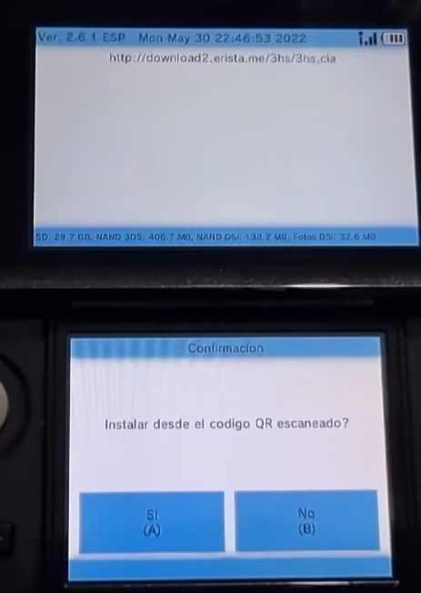

# Cómo instalar hShop
En esta página de la guía aprenderás a instalar hShop en tu Nintendo 3DS.
### ¿Qué es hShop?
hShop es un programa que nos permitirá descargar todos los juegos, DLCs y actualizaciones que hayan salido al mercado de 3DS.

Además, también nos permitirá instalar juegos DSiWare, que fueron una familia de juegos que solo salió para consolas DSi; y juegos de la virtual console, que eran juegos de consolas NES, GameBoy Advance, GameBoy y GameGear.

Si tienes una **New** Nintendo 3DS podrás jugar a juegos de la Super Nitendo, ya que estos son específicos de esa consola, debido a la CPU mejorada de la nueva consola.

## Instalando hShop

Enciende tu consola 3DS y abre FBI.

Desplázate hasta el botón `Instalación remota` (en inglés `Remote install`)

Pulsa en Escanear Código QR (en inglés `Scan QR Code`)

Cuando la cámara se active, enfoca el siguiente código QR:

Deberíamos ver esta pantalla:

Pulsa A para instalar. Cuando el proceso termine, ve hasta el menú principal de FBI y pulsa START para cerrarlo.

Espera unos segundos y aparecerá en el menú HOME un regalo.

Desenvuelvelo y aparecerá 3hs (hShop).

## Explicación de hShop

Cuando entres al programa verás diferentes opciones. Esto es lo que significa cada una:

- Games: juegos oficiales de 3DS
- Updates: Actualizaciones de los juegos de 3DS
- DLC: los DLC de los juegos de 3DS
- Virtual Console: juegos de DSiWare, NES, GameBoy Advance, GameBoy, GameGear y SNES (este último es exclusivo de New Nintendo 3DS)
- Injects: juegos hechos por fans. No verás esta opción, ya que fue eliminada por la baja calidad y rendimiento de estos.
- DSiWare: juegos de DSi
- Videos: trailers, videos o películas que salieron en la 3DS.
- Extras: aplicaciones de Homebrew, [romhacks](diccionario.md#romhack), etc.
- Thenes: temas oficiales de la eShop de 3DS. Para instalar temas custom, [ve a esta página de la guía](customthemes.md).

Cuando quieras instalar algún juego, escoge entre las opciones y pulsa el botón A.

